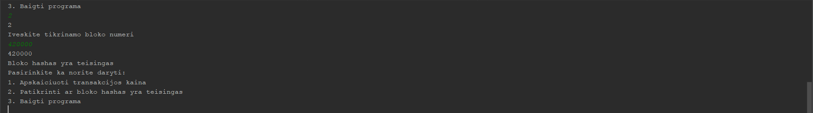

# BitcoinTask

---
## Link to the requirements of the task
[BitCoinTask](https://github.com/blockchain-group/Blockchain-technologijos/blob/master/pratybos/3uzduotis-Bitcoin-Core-API.md)
## Install instructions
1. Clone repository ```$ git clone https://github.com/gitguuddd/BitcoinTask.git``` or ```$ git clone git@github.com:gitguuddd/BitcoinTask.git``` if you're using SSH
2. cd to ```BitcoinTask```
3. Add a remote interpreter via SSH, a fully configured, python compatible bitcoin full node is required for this step
3. ```python main.py```, while using the remote interpreter
---
## Terms of use

- After you start the program you will be greeted with a menu that looks like this:
```
   Pasirinkite ka norite daryti:
   1. Apskaiciuoti transakcijos kaina
   2. Patikrinti ar bloko hashas yra teisingas
   3. Baigti programa


   ``` 
- Choose the first option to calculate the fee of the chosen transaction
- Choose the second option to check if hash of the chosen block is valid
- Choose the third option to exit the program
---
## Python configured bitcoin full node provided by my homeboy [Augustinas Makevičius](https://github.com/AugustinasMK)

- Special thanks to [Žygimantas Augūnas](https://github.com/zygisau) for help with setting up remote interpreter


---
## Testing the fee calculation function on the costliest transaction (291.240900 BTC)


---
## Checking if block 420000 hash is correct



## Changelog

---
[v1.0](https://github.com/gitguuddd/BitcoinTask/releases/tag/v1.0) - (2019-11-29)

**Added**
- Initial files
- ```drivefuncs.py```
- ```globals.py```
- functions for calculating transaction fee
- functions for verifying block hashes
- README
---
## Program structure
- ```drivefuncs.py``` contains all the necessary functions for fee calculation amd block hash verificatiom
- ```globals.py``` contains the shared globals of the program
- ```main.py``` contains the main interface of the program